# Logica 🧠

🧠 Treino e aprendizado de lógica

Repositório onde publico **exercícios para melhorar a lógica de programação** por meio de **representações de algoritmos** como **descrição narrativa, fluxogramas, portugol e scratch**.

---

## Glossário

### `Ambiguidade`
Propriedade de uma palavra ou frase que permite duas ou mais interpretações. Essa propriedade pode causar mal-entendimentos e dificulta a interpretação.
[Saiba Mais](https://www.todamateria.com.br/ambiguidade/)

### `Sintaxe`
No caso da programação, é um conjunto de regras que determina a estrutura e escrita correta das instruções/códigos.  
A sintaxe e a lógica estão muito correlacionadas, porque enquanto a sintaxe seria a escrita de uma instrução, a lógica seria a validação dessa sintaxe.  
Um exemplo simples em linguagem natural:

#### Sintaxe incorreta
`soamr dois números`

#### Sintaxe correta
`somar dois números`

#### Lógica incorreta
`somar duas letras`

#### Lógica correta
`somar dois números`

[Saiba Mais](https://en.wikipedia.org/wiki/Syntax_(programming_languages))

#### Resumo
Sintaxe foca na gramática, ou nas regras de uma instrução, e lógica foca no raciocínio, se aquela instrução faz sentido.


### `Indentação`
Refere-se ao recuo no início de uma determinada linha de código, representando uma hierarquia visual. Quanto mais indentação, mais o código vai para a direita.

<div align="center">
    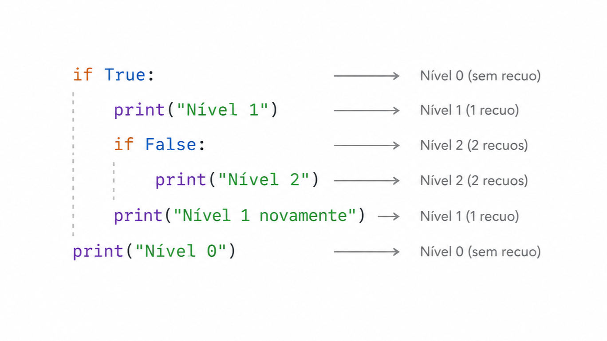
</div>

Repare que cada indentação, representa que aquele bloco de código está dentro de uma estrutura, nesse caso, o `if`.

---

## Estrutura do repositório
```txt
├─Logica
│   ├───descricao-narrativa
│   │   ├───[exercícios]
│   │   └───exercises.md
│   ├───fluxogramas
│   │   ├───[exercícios]
│   │   └───exercises.md
│   ├───portugol
│   │   ├───CursoEmVideo
│   │       └───[exercícios]
│   │   ├───DavidCreator
│   │       └───[exercícios]
│   │   ├───Outros
│   │       └───[exercícios]
│   ├───scratch
│   │   └───[exercícios]
│   ├───README.md
```

---

### [descricao-narrativa](descricao-narrativa)
A **descrição narrativa** é um algoritmo escrito em **linguagem natural** (*português*). São simples e muito fáceis de serem criadas.

### [fluxograma](fluxograma)
O **fluxograma** é uma representação visual por meio de figuras visuais com setas. Seguem um tipo de ["sintaxe"](#sintaxe) que deve ser seguida.

### [portugol](portugol)
**Portugol** é uma **pseudo-linguagem** para facilitar o aprendizado da *lógica de programação* por meio de comandos semelhantes a uma linguagem de programação. Foi criada especialmente para ensinar lógica de programação.

### [scratch](scratch)
O **Scratch** é uma linguagem de **programação visual de blocos de arrastar e soltar**, projetado para **crianças** e **jovens** que querem aprender lógica de programação.

Saiba mais na seção [Como representar algoritmos](#formas-de-representação-de-algoritmos)

# Lógica de programação

## Os 4 pilares
Na lógica de programação, temos uma subárea que chamamos de **Pensamento Computacional**, responsável por dividir um problema em 4 pilares menores, que quando dominados, dão a capacidade ao desenvolvedor a **resolver problemas** de uma forma mais efetiva. A seguir, serão apresentados esses quatro pilares: **Decomposição**, **Reconhecimento de Padrões**, **Abstração** e **Algoritmos**

<div align="center">
    <a href="https://pt.wikipedia.org/wiki/Pensamento_computacional">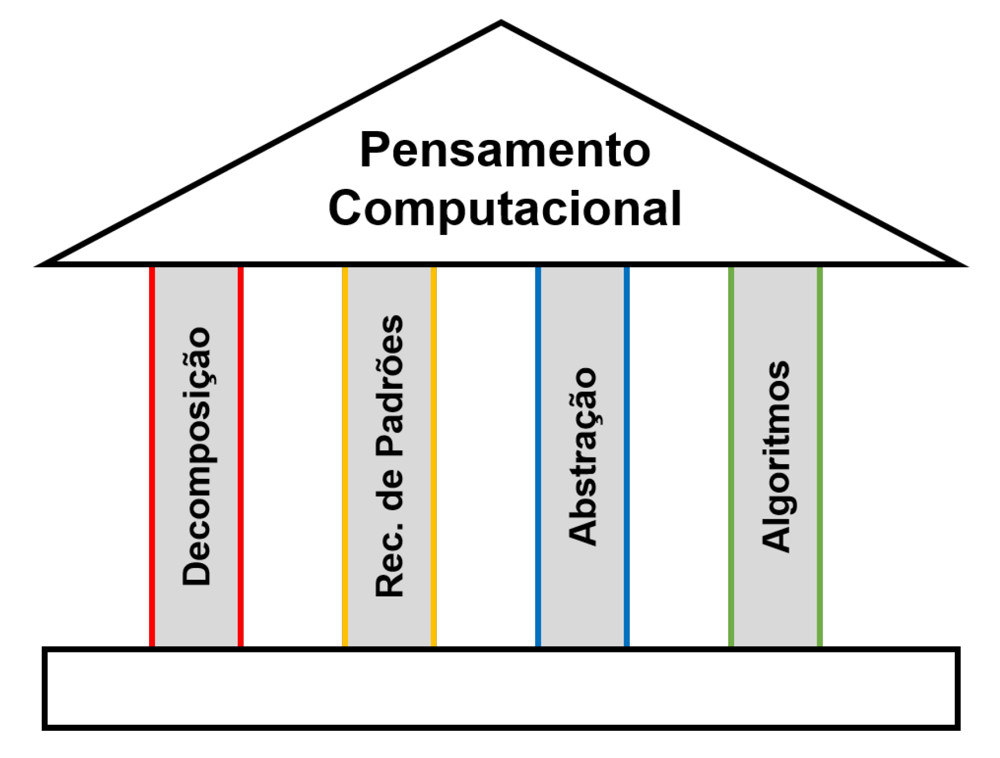</a>
</div>

Recomendo a leitura *[deste artigo (em inglês)](https://dev.to/dev_frank/how-to-think-like-a-programmer-29a8)*, dizendo mais sobre como **pensar como um programador** - uma habilidade que é **destaque**, que separa programadores que apenas **decoram [sintaxe](#sintaxe)** de aqueles que pensam em como **resolver problemas**.

> [!IMPORTANT]
> Antes de começarmos, um aviso importante.    
> Eu utilizo a palavra *algoritmo* diversas vezes ao longo dos quatro pilares, porém ele é o último pilar do *Pensamento Computacional*. Então aqui vai um breve resumo do que é um algoritmo   
> Um algoritmo basicamente é um passo a passo de instruções ordenadas e finito. É como seguir uma receita culinária ou ler um manual. É um passo a passo lógico.

### Decomposição
É a habilidade de **dividir um problema grande em problemas menores**. Essa é a habilidade mais *importante* de um programador. Consiste em simplesmente pegar um **problema maior** e **transformá-lo** em um **subproblema menor** de acordo com algumas **perguntas** e **análises**.

<div align="center">
    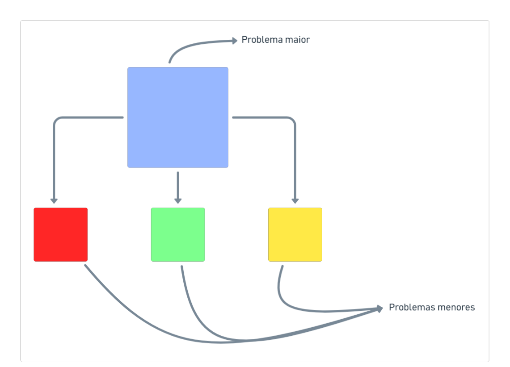
</div>

Na imagem acima, temos um **quadrado maior** preenchido de azul, representando o **problema maior**, e nas setas temos **quadrados menores** representando os **problemas menores**, ou os **subproblemas**. A *decomposição* é basicamente isso.   
Vamos ver um exemplo da decomposição aplicado na vida real. Vamos supor que desejemos **fazer um carro**. Podemos nos perguntar: *Do que é feito um carro?* A partir dessa pergunta, podemos fazer mais perguntas e assim então **decompor um problema gigante em um problema que há subproblemas mais fáceis de se resolver**.

```txt
Carro
    Pneus
        Borracha
        Aço
    Volante
        Borracha
        Metal
    Motor
        Metal
            Ferro
    Vidros
        Areia
    Bancos
        Aço
        Espuma
        Tecido
            Nylon
                Petróleo
            Poliéster
    ...
```

Agora ficou mais fácil de entender, porque o problema pode ser visto não mais como um **problema gigante de se resolver**, mas sim como um problema que há **problemas menores** e **mais fáceis de serem realizados**. Dividimos o problema do carro em problemas menores - *pneus*, *volante*, *motor*, *vidros*, *bancos* - e cada problema menor ainda tem seus **subproblemas**. Basicamente, isso é *decomposição*.

Você provavelmente já deve ter visto aquela aula de matemática sobre **decomposição de números**. Vamos relembrar como é e sua relação com a decomposição do *pensamento computacional*.

<div align="center">
    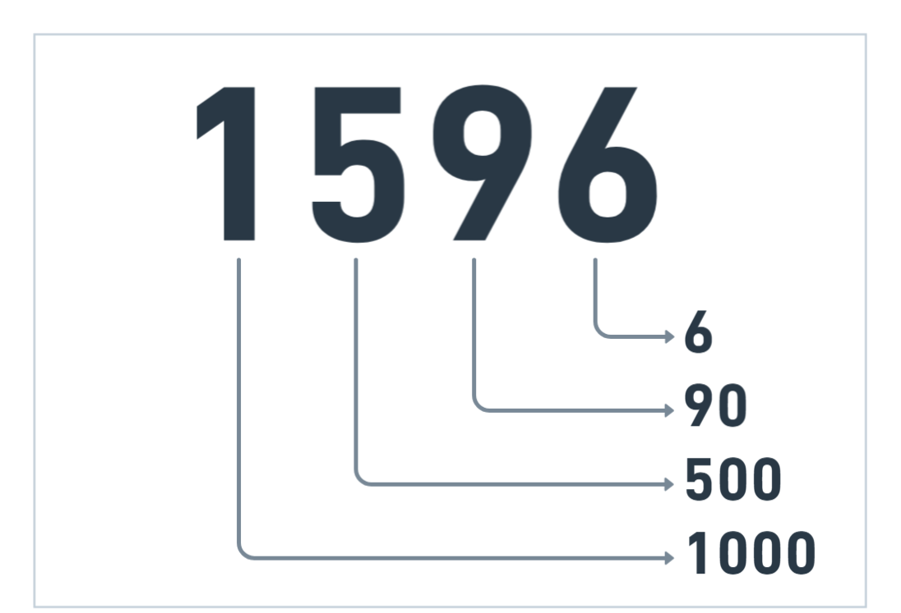
</div>

A imagem acima representa uma *decomposição de um número*. Isso serve igualmente para a decomposição do pensamento computacional. Se somarmos `1000 + 500 + 90 + 6`, o resultado será `1596`.

#### Resumo
A *decomposição* acontece quando você **divide um problema em problemas menores**, assim facilitando a **resolução de cada problema menor**. Cada problema menor forma uma **solução pequena**, ou seja, **uma parte do problema maior**.

### Reconhecimento de padrões
É a habilidade de **reconhecer padrões**, ou seja, **identificar similaridades de problemas já resolvidos antes**. Essa habilidade exige *prática*, porque para você *identificar padrões* de *problemas anteriores*... Você tem que ter feito algum *problema anterior* para tentar encontrar **similaridades** em um outro problema. 

<div align="center">
    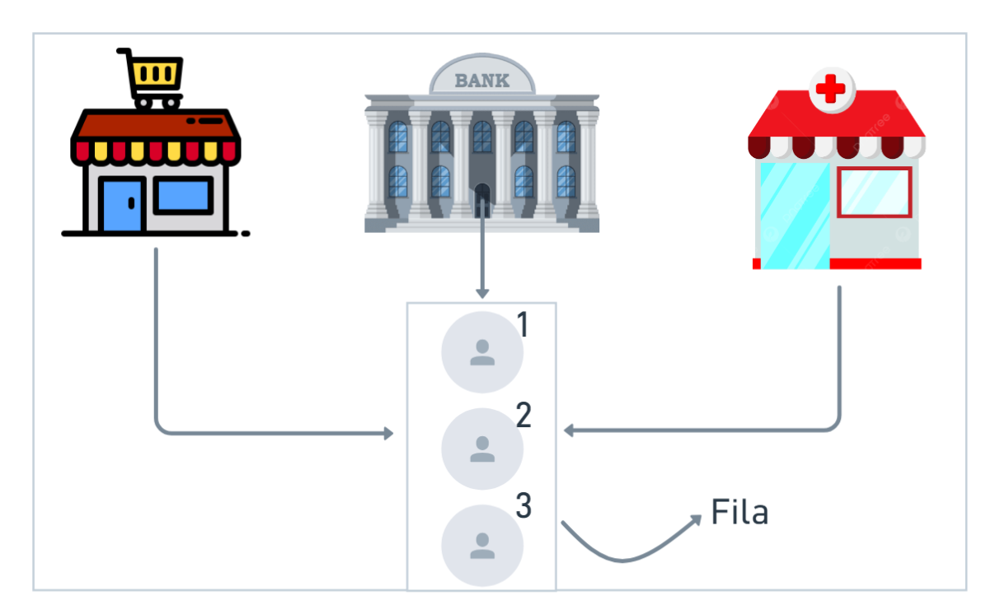
</div>

No exemplo acima, podemos ver que todos os *três veículos* (**carro, bicicleta e moto**) possuem algo em comum: **rodas**. Então se nós criássemos um *carro*, uma *bicicleta* ou uma *moto*, poderíamos utilizar nossa *memória* para **reconhecer um padrão** que já foi resolvido anteriormente - a **roda**. Isso nos permite **resolver problemas** de uma maneira mais **rápida** porque já sabemos exatamente o que fazer, e não será necessário *pensar novamente*.

É claro que nesse exemplo e em outros, você irá *reconhecer padrões*, mas na maioria das vezes irá precisar **alterar algumas coisas**. Por exemplo, nessa situação da imagem, os **materiais** e as **proporções** são **diferentes**, mas a **ideia** é a mesma.

### Abstração
É a habilidade de **focar apenas nos aspectos úteis/importantes**. Por exemplo, Na **criação de um bolo**, a **cor da panela não importa**; Mas **verificar se os ingredientes do bolo ainda estão dentro da validade é importante**; Num *algoritmo*, a abstração é muito útil porque você pode se perguntar: *Será que minha instrução está pouco abstraída ou muito abstraída? Ou seja, será que a instrução que eu coloquei está clara demais, ou ainda preciso ser ainda mais detalhado?*

<div align="center">
    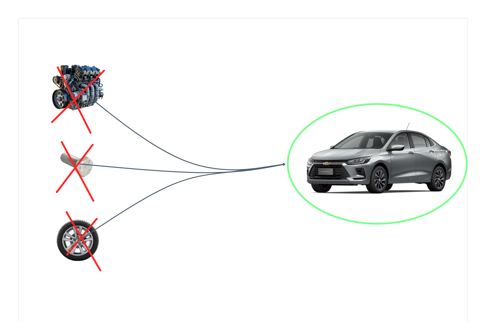
</div>

Visualize a imagem acima. Agora se pergunte: *Será que, um passageiro do carro, precisaria verificar esses detalhes para visualizar um carro?* Quando você imagina um carro, você imagina ele *pronto*, ou pensa em cada *parafuso*, em cada *banco*, em cada *janela*, em cada *pneu*, ou no *motor*?

Todos nós imaginamos um *carro pronto*. E isso importa para a criação de um algoritmo, porque o *nível de abstração* é importante para não haver [ambiguidades](#ambiguidade) no nosso algoritmo.

#### Nível de Abstração
O nível de abstração pode depender entre **muito abstraído** até **pouco abstraído**. Veja exemplos:

##### Muita abstração
```txt
Ligar o carro
```

##### Abstração ideal
```txt
Pegar a chave do carro
Ir perto do carro
Clicar no botão de ligar
```

###### Pouca abstração
```
Ir até a chave do carro
Verificar se a chave do carro é a sua
Se for
Pegar a chave do carro
Se não
Pule para a próxima chave
Vá até o carro
Verifique cada botão da chave
Se o botão for o de ligar
Aperte no botão
Se não
Pule para o próximo botão
```

O **nível de abstração** que realizamos num algoritmo é **importante**, porque ele deve ficar num **meio termo**, ou seja, nem **muito abstraído**, nem **pouco abstraído**.

### Algoritmos
Algoritmos são **sequências de passos ordenados e finitos que resolvem um problema**. Utilizamos os três pilares vistos anteriormente (*decomposição*, *reconhecimento de padrões* e *abstração*) para a criação de um algoritmo.   
> [!NOTE]
> **Observação**: Um algoritmo não é um termo somente da *computação*. Utilizamos algoritmos em várias **situações de nossas vidas**, **todos os dias**.

Vamos ver um exemplo de algoritmo: **A criação de um bolo**

<div align="center">
    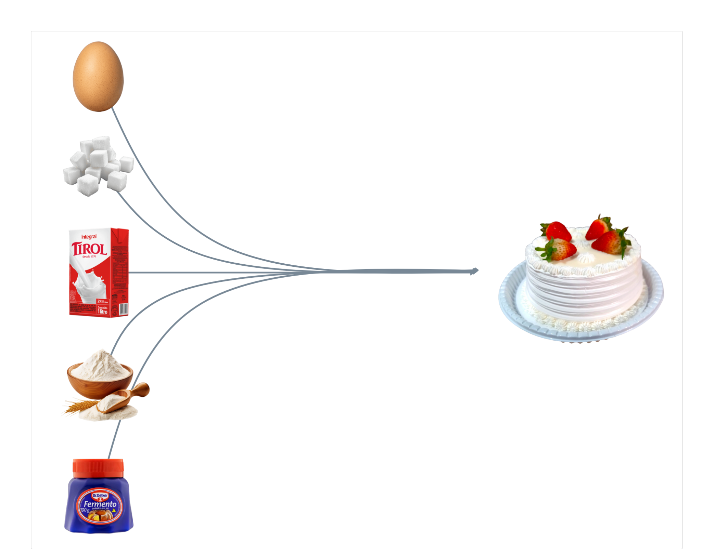
</div>

No exemplo acima, podemos observar que os ingredientes obtidos (**ovo**, **açúcar**, **leite**, **fermento** e **farinha de trigo**) levam à **resolução do problema** (*fazer um bolo*). É claro que nesse caso, abstraímos bastante o algoritmo. Não levamos em consideração uma **panela**, um **fogão**, uma **colher**, uma **xícara**, etc, etc, etc... Mas o importante aqui é pegar a ideia: O **algoritmo é uma sequência de passos**, esse é o resumo mais sucinto possível de um algoritmo.

Agora, vamos ver um exemplo de um algoritmo para a criação de um bolo real.  
[Fonte: https://receitas.globo.com/tipos-de-prato/bolos/bolo-de-chocolate-facil.ghtml](https://receitas.globo.com/tipos-de-prato/bolos/bolo-de-chocolate-facil.ghtml)

#### Exemplo de algoritmo: Fazer um bolo
1. **Massa**
   1. Em uma tigela, coloque 3 ovos, 1 e meia xícara de chá de açúcar, meia xícara de chá de óleo, 1 xícara de chá de chocolate em pó e 2 xícaras de chá de farinha de trigo. Misture delicadamente os ingredientes.
   2. Em seguida, adicione 1 xícara de chá de água quente, 1 colher de sopa de fermento em pó e bata até ficar homogêneo.
   3. Transfira a massa para uma forma untada e enfarinhada com uma mistura de farinha de trigo e chocolate em pó. Leve para assar em forno preaquecido a 180 graus Celsius por 40 minutos.
2. **Cobertura**
   1. Em uma panela, coloque 1 e meia xícara de chá de leite, meia xícara de chá de chocolate em pó, 1 colher de sopa de manteiga e 1 xícara de chá de açúcar. Misture, ligue o fogo e deixe ferver.
   2. Despeje a calda no bolo ainda quente e sirva em seguida.

Observe que nosso algoritmo segue um **passo a passo ordenado** (1, 2, 3...). Essa já é uma **característica** de um algoritmo. Outra característica de um algoritmo é que ele não pode ter suas **instruções fora de lugar**.  
Observe a instrução 1.3, em que diz *"Transfira a massa para uma forma untada e ..."*, se nós trocássemos de posição com a instrução 1.1, teríamos um **erro lógico**, já que necessitamos **obrigatoriamente primeiro fazer a ação 1.1 para depois fazer a ação 1.3**.  
Uma última característica de algoritmos é que ele deve ser **finito**, isso é, ele deve ter um **fim**, ele precisa **acabar** alguma hora. Se um algoritmo é **infinito**, então ele **não é um algoritmo**.

## Os 4 pilares: Resumo
Como resumo, teremos um **breve resumo** do que é cada pilar.

* Decomposição: Dividir o problema em partes menores.
* Reconhecimento de Padrões: Reconhecer padrões de problemas já feitos anteriormente.
* Abstração: Focar em aspectos úteis e esconder detalhes inúteis ou esclarecer detalhes importantes.
* Algoritmos: Sequência de passos finitos, ordenados e sem [ambiguidade](#ambiguidade).

# Algoritmos

## Formas de representação de algoritmos
Como vimos anteriormente, [algoritmos são **sequências de passos ordenados e finitos que resolvem um problema**](#algoritmos). Agora, vamos ver sobre como **representá-los**, não apenas em **código** ou em uma **linguagem de programação**, mas sim em outras **formas visuais** ou mais **fáceis** de serem **compreendidas**.

Aqui vão algumas formas de representação:

### Pseudo-linguagem ou Pseudo-código
**Pseudo-linguagem** é uma forma de representação semelhante a uma **linguagem de programação**, mas como seu próprio nome diz (*pseudo*), ela é *"falsa"*. Isso porque pseudo-linguagens **não são utilizadas mundialmente** (em um ambiente sério), mas sim **exclusivamente para aprender lógica**. Em outras palavras, é uma **linguagem informal**.

#### Pontos positivos
* Você aprende uma linguagem que é muito **semelhante** a uma linguagem normal, se adequando mais facilmente posteriormente.
* Uma pseudo-linguagem tem sua própria [sintaxe](#sintaxe), isso é bom porque você segue aquelas **regras** da própria linguagem e não deixa espaços para [ambiguidades](#ambiguidade).

#### Pontos negativos
* É necessário aprender a [sintaxe](#sintaxe) da linguagem, o que pode ser meio **desnecessário** para quem quer aprender **apenas a lógica**. É por isso que muitas pessoas preferem partir logo para uma linguagem de programação, justamente porque às vezes é **desnecessário** aprender uma linguagem em que você não irá utilizar **profissionalmente**. Seria mais fácil aprender uma linguagem com [sintaxe](#sintaxe) mas ao menos essa for utilizada **mundialmente**.

#### Exemplo de Pseudo-linguagem (Portugol)
O exemplo mais famoso de *pseudo-linguagem* no Brasil é o [**Portugol versão VisuAlg/Português Estruturado**](https://pt.wikipedia.org/wiki/Portugol). Veja um exemplo bem simples da pseudo-linguagem abaixo.

<div align="center">
    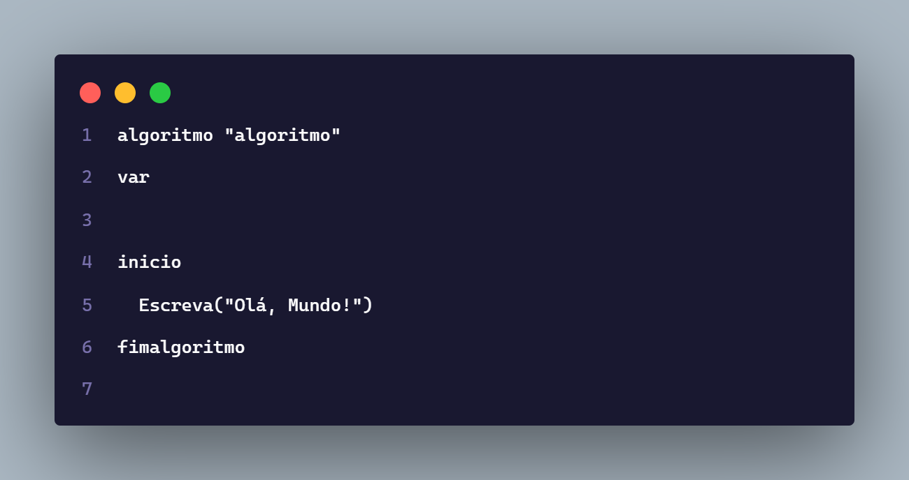
</div>

Perceba a [sintaxe](#sintaxe) do Portugol. Ele utiliza palavras como *algoritmo*, *var*, *inicio*, ...  
Essas palavras são as "**regras**" da pseudo-linguagem, e devem **ser seguidas**, caso contrário ocasionará em **erros de [sintaxe](#sintaxe)**.

### Fluxograma
O Fluxograma é uma **representação visual** de um algoritmo. São utilizadas **formas geométricas** que seus significados variam de **forma para forma**. O fluxograma, assim como o *pseudo-código*, segue um **padrão que precisa ser seguido**, de acordo com a **[ISO 5807](https://www.abenge.org.br/cobenge/legado/arquivos/20/st/q/q162.pdf)**.  
[Símbolos do fluxograma](https://zeev.it/blog/5-passos-para-criacao-de-um-fluxograma/#9)

#### Pontos positivos
* Facilita a **compreensão do fluxo lógico**, pois utiliza **setas** que representam o **fluxo de execução** do programa.
* Serve como **ponte de comunicação entre desenvolvedores**, e é um **padrão** muito utilizado profissionalmente, **facilitando a comunicação**.

#### Pontos negativos
* Dependendo do crescimento do fluxograma, a lógica pode ficar **extremamente confusa** de se entender.
* **Alterar** a lógica de um programa pode exigir o **redesenho completo do fluxograma, o que consome bastante tempo**.
* Geralmente é utilizado um **software** dedicado à criação de fluxograma, como *[Lucidchart](https://lucid.co/pt/lucidchart)* ou *[Draw.io](https://app.diagrams.net/)*, pois **desenhar à mão é inviável**.

#### Exemplo de fluxograma

<div align="center">
    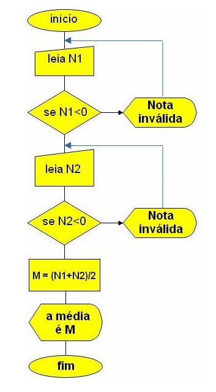
</div>

### Descrição Narrativa ou linguagem natural
A descrição narrativa é uma forma **textual** de se representar um algoritmo. É muito **fácil** de se fazer a representação porque você simplesmente usa **apenas a lógica** e suas próprias palavras, e não precisa seguir uma **sintaxe rígida**.

#### Pontos positivos
* Não é necessário seguir uma **sintaxe rígida**, você cria sua própria sintaxe (mas precisa ao menos seguir um padrão mínimo, por exemplo as instruções `se` e `enquanto`, que são utilizadas para condição e repetição respectivamente).
* Não precisa de **nenhuma ferramenta extra**, pode ser desde uma **folha de papel** até o **notepad**.

#### Pontos negativos
* Tem mais chance do algoritmo ter **[ambiguidades](#ambiguidade)**, pois como vimos anteriormente, a linguagem natural não tem uma sintaxe propriamente definida, então estará mais **suscetível a más interpretações/[ambiguidades](#ambiguidade)**

#### Exemplo de descrição narrativa

<div align="center">
    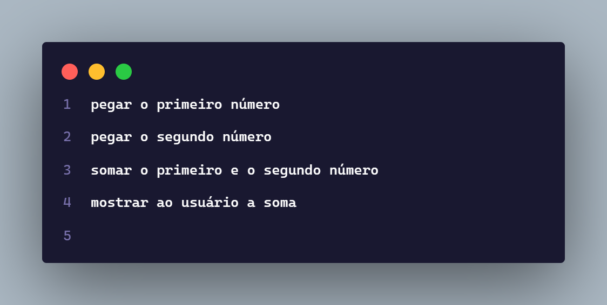
</div>

---

# Conceitos de lógica de programação
Os conceitos de lógica de programação são **essenciais** para todo desenvolvedor, que verá isso mais cedo ou mais tarde. Com esses conceitos, a **lógica é a mesma** em todas e em qualquer linguagem de programação. A única coisa que muda é a **[sintaxe](#sintaxe)** de cada linguagem. Exemplos de linguagens são **C**, **Java**, **Python**, **Go** e **Ruby**. A lógica utilizada nelas são as mesmas, a única diferença é que cada uma terá uma **regra diferente de declaração de instruções**.

Para os exemplos abaixo, utilizaremos a linguagem *Python*, mas os comandos **poderão ser replicados em qualquer outra linguagem**. Para acompanhar aos exemplos abaixo, recomendo utilizar o [online-python](https://www.online-python.com/) como **interpretador** por enquanto se você ainda não tem/não sabe fazer a instalação do python.

Lembrando que esse repositório **não substitui nenhum curso de python**. Para se especializar em Python, recomendo que vá até a seção [Python](#python)

## Variáveis e constantes
As variáveis são **valores armazenados na memória do computador**, que poderão ser utilizados **posteriormente** no algoritmo. A forma mais fácil de se entender uma variável é no código.

Vamos supor que queremos armazenar uma variável chamada idade, e com qualquer valor, por exemplo, 23.
```py
idade = 23
```

Como podemos ver, `idade` é o nome da variável, e `23` é o valor que ela guarda.  
Observe que a **declaração de uma variável** segue a seguinte [sintaxe](#sintaxe):

```py
nome_da_variavel = valor_da_variavel
```

Agora, mais exemplos de declaração de variáveis:
```py
nome = "flameastro"  # Observe que utilizamos aspas duplas para armazenar textos. Veremos isso adiante
quantidade_clientes = 450
total_vendas = 125
saldo = 76500.54  # Usamos o ponto (.) ao invés da vírgula (,) para representar números decimais
```

Perceba que sempre utilizo o padrão **[snake_case](https://en.wikipedia.org/wiki/Snake_case)**, um padrão recomendado para o python, em que você **substitui os espaços do nome de uma variável (se ela tiver) por underlines (_)**.

<div align="center">
    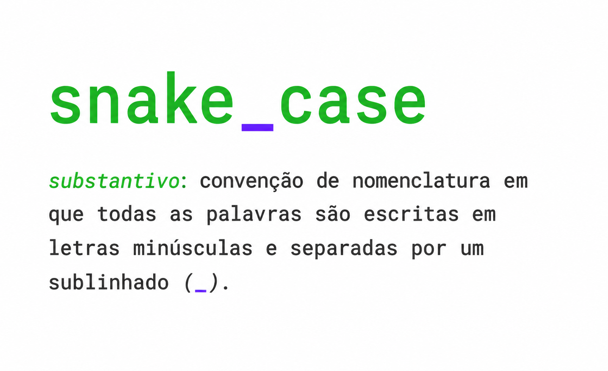
    <p><a href="https://khalilstemmler.com/blogs/camel-case-snake-case-pascal-case/#Snake-case">Fonte</a></p>
</div>

Uma **constante é uma variável**, mas a única diferença é que o **seu valor não pode ser alterado**. O python **não tem um suporte nativo com constantes**, mas declaramos o nome da variável como **uppercase** (*maiúsculas*).

```py
PI = 3.1415
GRAVIDADE = 9.8
VELOCIDADE_DA_LUZ = 299792458
```

## Tipos de dados
Os tipos de dados representam o **tipo que o valor** de uma variável possui. Você lembra da sintaxe da declaração de uma variável, que vimos anteriormente? O `valor_da_variavel` que apresentei anteriormente, **possui obrigatoriamente um tipo**. Pode ser `caractere`, `número` ou `lógico`. A seguir: O que cada tipo significa.

### Caractere
Representa um **texto**, uma **frase** ou qualquer outra coisa que seja **relacionados a texto**. Alguns exemplos são:

```py
nome_de_usuario = "flameastro"
descricao_repositorio = "🧠 Treino e aprendizado de lógica"
email = "exemplo@dominio.com"
```

### Número
Representa um **número**, seja ele **inteiro** ou **decimal**.

#### Inteiro
São **números inteiros que não possuem vírgula**, ou seja, ponto em Python.

```py
estrelas = 15
repositorios = 26
contribuicoes = 876
```

#### Flutuantes ou Decimais
Representa um número que possui **números após a vírgula**, os famosos **números quebrados**.

```py
frete = 12.5
area = 6.245
imposto = 25.63
```

### Lógico
Os valores lógicos podem ter apenas um de dois valores: **`True` ou `False`**, representam **verdadeiro**/**ligado**/**aceso** e **falso**/**desligado**/**apagado**, respectivamente.

```py
porta_aberta = True  # porta aberta
luz_acesa = False  # luz apagada
maior_idade = True  # Tem mais de 18 anos
```

### Exemplos de cada tipo
Vamos ver alguns exemplos de declarações de variáveis com cada um dos tipos:

```py
nome = "Matheus"
idade = 27
saldo = 4556.34
tem_pet = False
```

## Operadores
Existem diversos operadores: Os **aritméticos**, os de **comparação**, e os **lógicos**. Eles possuem esse nome porque **operam com dois valores**, chamados de **operandos**. Veremos cada um a seguir.

<div align="center">
    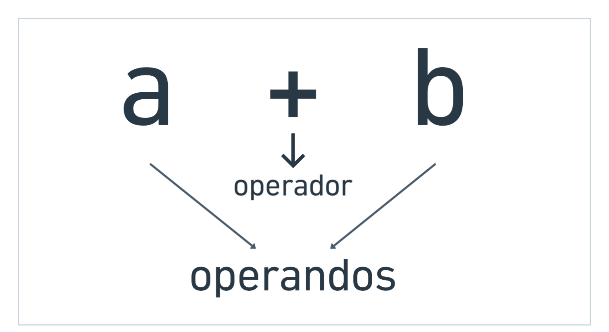
</div>

### Operadores aritméticos
Os operadores aritméticos são os **clássicos da matemática**. Entre eles estão o operador de **adição**, de **subtração**, de **multiplicação**, de **divisão**, e outros "**especiais**" do Python, como você pode ver na seguinte tabela:

| Operador | Nome                     | Exemplo  | Resultado |
|----------:|--------------------------|----------|-----------|
| `+`       | Adição                   | `5 + 3`  | `8`       |
| `-`       | Subtração                | `5 - 3`  | `2`       |
| `*`       | Multiplicação            | `5 * 3`  | `15`      |
| `/`       | Divisão                  | `5 / 2`  | `2.5`     |
| `//`      | Divisão inteira          | `5 // 2` | `2`       |
| `%`       | Módulo (resto da divisão)| `5 % 2`  | `1`       |
| `**`      | Exponenciação            | `5 ** 2` | `25`      |

```py
5 + 3
5 - 3
5 * 3
5 / 2
5 // 2
5 % 2
5 ** 2
```

### Operadores de comparação
Os operadores de comparação são usados para **comparar operandos**. A **saída da comparação retorna um valor lógico (`True` ou `False`)**.

| Operador | Nome             | Exemplo  | Resultado |
| :------- | :--------------- | :------- | :-------- |
| `>`      | Maior que        | `5 > 3`  | `True`    |
| `<`      | Menor que        | `5 < 3`  | `False`   |
| `>=`     | Maior ou igual a | `5 >= 5` | `True`    |
| `<=`     | Menor ou igual a | `5 <= 3` | `False`   |
| `!=`     | Diferente de     | `5 != 3` | `True`    |
| `==`     | Igual a          | `5 == 3` | `False`   |


Vamos ver um exemplo simples: *5 é maior que 2*?
```py
5 > 2  # True
```

Nesse caso, sim, então retornará `True`.  
Com todos os operadores:

```py
5 > 3  # True
5 < 3  # False
5 >= 5  # True
5 <= 3  # False
5 != 3  # True
5 == 3  # False
```

### Operadores lógicos
Os operadores lógicos **agrupam operações e comparam entre dois valores lógicos**.

| Operador | Nome       | Exemplo          | Resultado |
| :------- | :--------- | :--------------- | :-------- |
| `and`    | E lógico   | `True and False` | `False`   |
| `or`     | Ou lógico  | `True or False`  | `True`    |
| `not`    | Não lógico | `not True`       | `False`   |

```py
operacao1 = 6 > 3
operacao2 = 12 > 9
print(operacao1 and operacao2)
```

Nós estamos comparando duas operações: `operacao1` e `operacao2`. Ambas as operações retornam `True`, mas na linha seguinte declaramos `print(operacao1 and operacao2)`, que pode ser entendido como `True and True`. Agora ficou mais fácil, é como dizer: "*verdadeiro e verdadeiro*", que resulta em verdadeiro (`True`).

Veja a seguir sobre a **[tabela verdade](#tabela-verdade)**.

#### Tabela verdade
A **tabela verdade** é uma tabela que mostra **todas as combinações possíveis de valores lógicos** (`True` e `False`) e o resultado de uma **operação lógica** para cada uma delas.

##### `and` (E lógico)

|    A    |    B    | `A and B` |
| :-----: | :-----: | :-------: |
| `False` | `False` |  `False`  |
| `False` |  `True` |  `False`  |
|  `True` | `False` |  `False`  |
|  `True` |  `True` |   `True`  |

##### `or` (Ou lógico)

|    A    |    B    | `A or B` |
| :-----: | :-----: | :------: |
| `False` | `False` |  `False` |
| `False` |  `True` |  `True`  |
|  `True` | `False` |  `True`  |
|  `True` |  `True` |  `True`  |

##### `not` (Não lógico)

|    A    | `not A` |
| :-----: | :-----: |
| `False` |  `True` |
|  `True` | `False` |

#### and
Só retorna `True` se **ambos os operandos forem `True`**. Caso o operando da direita, ou o da esquerda, ou ambos forem `False`, então o `and` retornará `False`.

É como dizer: "*Se João e Maria forem para a festa, eu vou*".   
Você só vai para a festa se ambos forem

#### or
Retorna `True` quando tem **ao menos um operando que retorna `True`**, e retorna `False` se ambos forem `False.`

É como dizer: "*Se João ou Maria forem para a festa, eu vou*".   
Você só vai para a festa se ao menos um dos dois forem

#### not
Sempre **retorna o valor contrário**. `True` vira `False`, e `False` vira `True`

`not True` -> `False`
`not False` -> `True`

## Estruturas Condicionais
São estruturas que executam um bloco de código **se uma condição for satisfeita**, ou seja, **verdadeira**.

### Simples
É o tipo **mais simples** de condicional. Ela só pode ter um `if`. Funciona desse jeito:

```py
if (condicao):  # Os parênteses podem ser omitidos ou declarados, não fará diferença
    <bloco de código>
```

A **condição** significa uma **operação**, que vimos anteriormente. Essa operação tem que ser do tipo **lógico** (`True` ou `False`). No tipo de condição simples, o `<bloco de código>` só será executado caso a **`condicao` for `True`**.

> [!NOTE]
> **Indentação**    
> Temos que notar uma coisa. O `<bloco de código>` está um pouco para a **direita em relação ao `if condicao:`**. O nome dessa **deslocação** é chamada de **[indentação](#indentação)**.

Vamos aquecer mais um pouco e ir a um exemplo real.

```py
idade = 32
if (idade >= 18):
    print("Maior de idade")
```

Nesse caso, a saída do nosso código será `Maior de idade`, porque declaramos a idade como `32`, e na condição temos `idade >= 18` (Lê-se "*idade é maior ou igual a 18*")?, que ocasionará numa condição verdadeira.    
Mas e se a idade fosse igual a `15`?

```py
idade = 15
if (idade >= 18):
    print("Maior de idade")
```

O python **não retornará nada** na saída, porque repare: O código só será executado **se a idade for maior ou igual a 18 anos, se for menor, então não fará nada**.

Vamos ver mais alguns exemplos:

```py
user = "admin"
password = "admin"

if (user == "admin" and password == "admin"):
    print("Olá, admin!")
```

Nesse caso, a saída será `Olá, admin!`, porque as **duas condições são satisfeitas** (são verdadeiras). Como podemos perceber, `user == "admin"` retorna `True`, e `password == "admin"` também. Juntando `True and True`, o resultado será `True`, e o bloco de código da estrutura condicional será **executado**.

Mas aqui temos uma limitação. E se por exemplo, quisessemos dizer ao usuário que ele não era admin? É aí que partimos para outro tipo de estrutura condicional: A **[composta](#composta)**.

### Composta
O tipo composto apresenta apenas **dois fluxos que sempre serão executados**. Ou será executado o `bloco de código 1` ou o `bloco de código 2`.

```py
if condicao:
    <bloco de código 1 ou bloco de código verdadeiro>
else:
    <bloco de código 2 ou bloco de código falso>
```

Lê-se: *Se a condição for verdadeira, execute o `bloco de código 1`, senão, execute o `bloco de código 2`*.

Agora, temos mais "liberdade" de condições, porque **sempre será executado alguma coisa**. Vamos ver um exemplo:

```py
idade = 19
if idade >= 18:
    print("Maior de idade")
else:
    print("Menor de idade")
```

Agora perceba que a idade é `19`, e na linha seguinte verificamos **se a idade é maior ou igual a `18`**. Nesse caso, é, mas se fosse, por exemplo, `12`, então a saída seria `Menor de Idade`, porque já que a condição é `False` (falsa), executará o `bloco de código 2` (`bloco de código falso`).

Voltando ao exemplo que vimos anteriormente do `user` e o `password`, vamos refazê-lo.

```py
user = "admin"
password = "admin"

if (user == "admin" and password == "admin"):
    print("Olá, admin!")
else:
    print("Olá, convidado!")
```

Agora a situação é um pouco diferente. Verificamos se `user == "admin"` e `password == "admin"`. Se for, imprimimos `Olá, admin!`, senão, `Olá, convidado!`. Perceba que agora **não tem como fugir**: o **programa sempre executará o primeiro ou o segundo bloco de código**, **porque se a primeira condição não for satisfeita, cairá no `else`**.

Com isso, podemos criar lógicas mais interessantes.

```py
valor_produto = 26.99
porcentagem_taxa = 15
valor_final = valor_produto + (valor_produto * (porcentagem_taxa / 100))

print(f"O valor final é de: R${valor_final}")  # Repare no "f" depois da abertura do parênteses, chamamos de f string, podemos incluir variáveis dentro dele
if (valor_final >= 100):
    print("Você ganhou um brinde!")
else:
    print("Você não ganhou um brinde")
```

Vamos analisar o código. Primeiro declaramos a variável como `valor_produto`, logo em seguida `porcentagem_taxa`, e depois fizemos o cálculo da taxa incluída sobre o valor do produto e colocamos na variável `valor_final`. Depois imprimimos o valor final, e logo em seguida verificamos se o `valor_final` é maior ou igual a `100`. Se for, imprimimos `Você ganhou um brinde!`, mas caso não for, imprimimos `Você não ganhou um brinde`.

Mas ainda tem um tipo que é mais poderoso que o tipo composto, que veremos a seguir: A [encadeada](#encadeada)

### Encadeada
O tipo encadeada é um tipo que possui **diversas verificações**. Antes tinhamos apenas duas opções, mas com o tipo encadeada, nossas possibilidades de condicionais se expandirão.

```py
if condicao:
    <bloco de código 1>
elif condicao:
    <bloco de código 2>
else:
    <bloco de código 3>
```

> [!NOTE]
> Você pode usar quantos `elif`s forem necessários.

Nossas possibilidades de condicionais se **multiplicaram** agora, porque podemos verificar quantas **condições precisarmos e executar um determinado bloco de código de acordo com uma condição correta**. Perceba que agora podemos **verificar múltiplas condições**.

Vamos ver um exemplo diferente agora. Pense assim: teremos um número, e temos que exibir como saída se esse número é `positivo`, `negativo` ou `nulo`.

```py
numero = 15
if (numero > 0):
    print("Positivo")
elif (numero < 0):
    print("Negativo")
else:
    print("Nulo")
```

Perceba que o número é `15`, então verificamos no if se o número é maior que 0, resultando em `Positivo`, logo depois, verificamos se o número é menor que 0, resultando em `Negativo`, e caso contrário, se o número não for nem `Positivo` nem `Negativo`, então resultará em `Nulo`. Esse exemplo é simples mas é eficiente para observar o quão bom é o tipo **[encadeado](#encadeada)**.

Outro exemplo que podemos ver é o exemplo do semáforo.

```py
cor = "amarela"

if cor == "verde":
    print("Vá!")
elif cor == "amarela":
    print("Atenção!")
elif cor == "vermelha":  # pode ser um else ou um elif
    print("Espere!")
```

Declaramos uma variável chamada `cor` e atribuímos o seu valor como `amarela`. Dentro da **estrutura condicional**, primeiro verificamos se a cor é `verde`, então resultará em `Vá!`, depois verificamos se a cor é `amarela`, e nesse caso é, resultando então em `Atenção!`, mas caso não fosse, resultaria em `Espere!`.  
Perceba que nessa estrutura que defini, **não possui um `else`**, já que ele **não é obrigatório**, lembre-se. Porém, nesse caso poderíamos sim ter **colocado apenas um `else`**.

A seguir, vamos verificar um outro tipo de estrutura condicional: a **[aninhada](#aninhada)**.

### Aninhada
Esse tipo se chama `aninhada` justamente porque conseguimos **aninhar** outras estruturas condicionais dentro dela. Podemos aninhar qualquer um dos **quatro tipos** que vimos: a **[simples](#simples)**, a **[composta](#composta)**, a **[encadeada](#encadeada)** e a **[aninhada](#aninhada)**, que veremos a seguir.

Imagine a **estrutura aninhada** como aquelas bonecas russas (*matrioska*) que **uma cabe dentro da outra**, basicamente é isso que uma estrutura de tipo [aninhada](#aninhada) é.

Veja a seguir a comparação das *matrioskas* com um código python usando o tipo [aninhado](#aninhada).

#### Matrioska
<div align="center">
    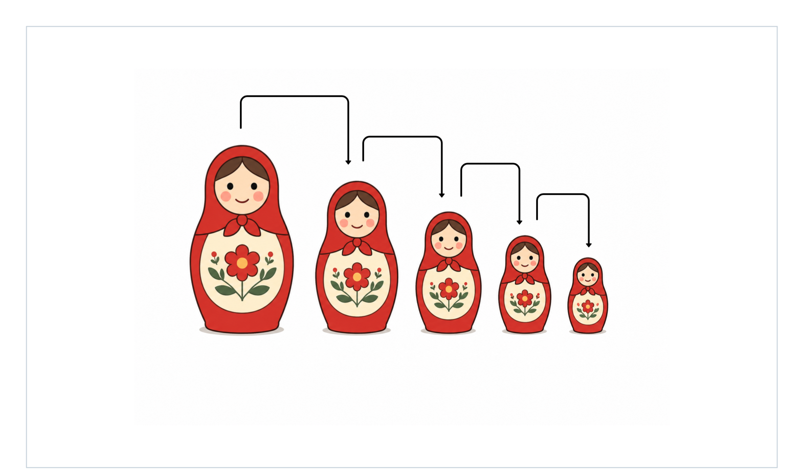
</div>


<div align="center">
    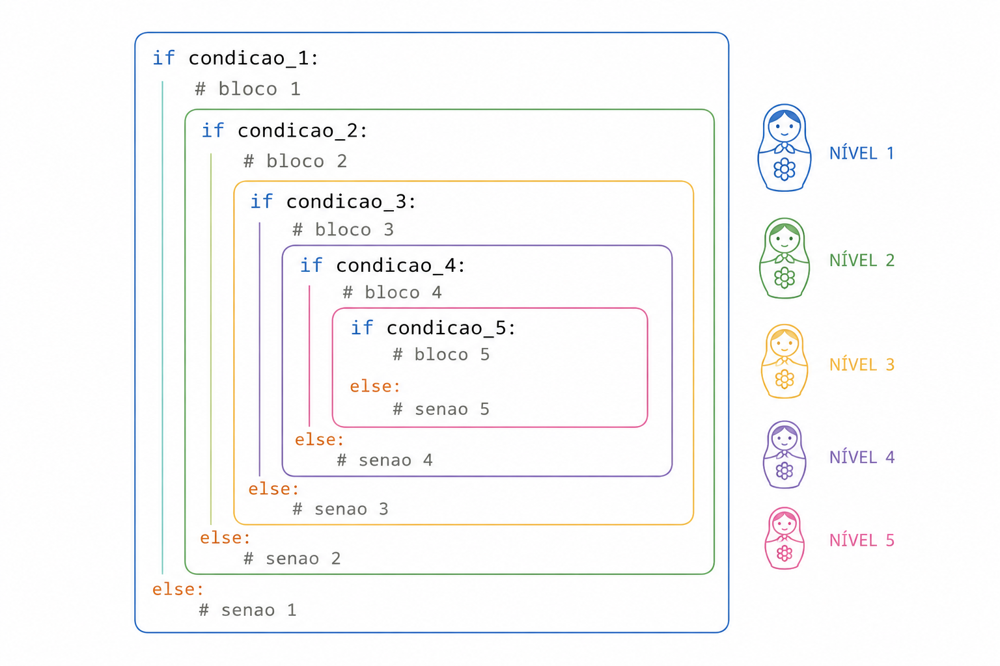
</div>

Como podemos ver, o tipo encadeado é muito semelhante às *matrioskas*, porque uma condição está **sob outra**.  
Um exemplo em Python seria:

```py
idade = 20
tem_carteira = True

if idade >= 18:
    print("Você é maior de idade")
    if tem_carteira:
        print("Pode dirigir!")
    else:
        print("Não pode dirigir, pois não tem carteira")
else:
    print("Você é menor de idade, não pode dirigir")
```

Vamos entender o código. Declaramos as variáveis `idade` e `tem_carteira`, como `20` e `True`, respectivamente. Logo em seguida, verificamos se a `idade` é maior que `18`, então imprimirá `Você é maior de idade`, logo verificamos se `tem_carteira` é `True`, e é, logo, imprimirá `Pode dirigir!`. Se o usuário tivesse uma `idade` menor que `18`, iria logo imprimir `Você é menor de idade, não pode dirigir`. E se o usuário tivesse uma idade maior que `18` porém não tiver carteira, então imprimiria `Não pode dirigir, pois não tem carteira`.

> [!NOTE]
> Lembre-se de que podemos colocar quantas estruturas condicionais e de qualquer tipo aqui.

## Estruturas de Repetição
As estruturas de Repetição são **estruturas semelhantes a que vimos anteriormente**, as **condicionais**. Elas também possuem uma **condição**, mas ao invés de executarem um bloco de código apenas uma vez, elas **repetem um determinado bloco de código até que a condição seja falsa**.    
Entre as estruturas de repetição, estão dois tipos principais: o `for` (para) e o `while` (enquanto). É comum chamar as estruturas de repetição como **`loops`**, então se acostume caso veja.

### For
O for é uma estrutura de repetição que é **mais simples** na sua sintaxe. Esse tipo de repetição é mais comum utilizar quando nós **sabemos previamente quantas vezes precisamos repetir um bloco de código**. Outra diferença é que não **precisamos declarar uma variável previamente** para executar o for.

```py
for <variavel> in range(inicio, fim-1, passos):
    <bloco de código>
```

> [!NOTE]
> Costumamos utilizar apenas o fim num for, ficando assim: `for <variavel> in range(fim): ...`. Se por exemplo quisessemos começar do 0 e ir até o 10, poderíamos simplesmente fazer `range(11)`, isso conta de 0 até 10. Também omitimos o `passos`, já que ele é automaticamente definido como `1` (vai de 1 em 1).

> [!NOTE]
> Outra observação que quero deixar é que a variável fim sempre irá do início até o fim-1, ou seja, se você coloca `range(1, 10)`, na verdade, vai de 1 até 9. Por isso que nos exemplos sempre adiciono + 1 no lugar de fim.

> [!NOTE]
> E por último, mais uma observação rápida. Normalmente, na definição de uma variável contadora, definimos seas das variáveis contadoras mais utilizadas. Você pode usar estas ou pode criar suas próprias variáveis, você que decide.
u nome com um padrão. Variáveis como `i`, `j`, `c` e `k` são algum
Contando de 1 até 10

```py
for i in range(1, 11):
    print(i)
```

Esse código nada mais faz do que imprimir de 1 até 10. Além de contar, podemos percorrer objetos iteráveis como arrays e strings, que veremos daqui para frente.

Perceba que a cada *iteração* (repetição), o `for` faz uma verificação. Ele se auto-pergunta: `i` é igual a `11`? Se for, ele para de executar o bloco de código na mesma hora. É por isso que se declaramos `for i in range(1, 10)`, o `i` irá valer `10`, porém para de executar na mesma hora.

Por enquanto, focaremos apenas em contar números. Vamos a outro exemplo: Contar de 0 até 100, mas apenas pares (pulando de dois em dois).

```py
for i in range(0, 101, 2):
    print(i)
```

Isso resultará em 0-100 pulando de 2 em 2 (**0, 2, 4, 6, 8, ...**).

Vamos a outro exemplo agora.

Vamos supor que queremos contar até o limite de uma variável chamado `limite`. Como poderíamos fazer isso? Por exemplo, se a variável `limite` for 50, temos que contar de 1 até 50, indo de 1 em 1.

```py
limite = 50

for i in range(1, limite+1):
    print(i)
```

Perfeito. Agora, vamos misturar um pouco as coisas (aqui está a verdadeira magia da programação). Vamos supor que agora queremos parar de contar quando o `i` estiver na metade da variável `limite`. Por exemplo, se definimos `limite` como `100`, teremos que parar de contar em `50`, pois a metade de `100` é `50` (`100 / 2`). Para esse problema, devemos utilizar uma estrutura de repetição seguida de uma estrutura condicional.

```py
limite = 60
metade = limite // 2

for i in range(1, limite+1):
    print(i)
    if (i == metade):
        break
```

> [!IMPORTANT]
> Sim, eu poderia ter declarado simplesmente `for i in range(1, metade+1): ...`, porém quis usar dessa forma para demonstrar o `if` junto com o `for`.

> [!NOTE]
> Repare que defini 60+1 porque se eu colocasse apenas `limite`, então iria até 59.

Então definimos `limite` com `60`, e declaramos a `metade` como `limite` dividido por 2 (inteiro). Isso garante que, se o número fosse ímpar, por exemplo, `15`, a metade daria `7.5`, porém perceba que o `i` sempre será inteiro, logo nunca chegaríamos a essa metade. Por isso é importante a divisão inteira. Logo após, defini um `for` que vai de 1 até o `limite+1` (60, nesse caso), e executa o bloco de código dentro do `for`.

Então podemos ler dessa maneira: *Para 1 até 60, imprima `i`, e se `i` for igual a `metade` do `limite`, para de executar*.

### While
O while é uma estrutura de repetição mais "**parruda**" e mais **direta**. Usamos ela quando não temos **previamente o número de repetições que será executado**. Por isso que é usado geralmente o `while True`, que é um comando para executar infinitamente o bloco de código dentro do while. Mas ainda sim podemos usar números inteiros igual no `for`, porém devemos declarar a variável antes do `while`.

```py
while condicao:
    <bloco de codigo>
```

No `while`, devemos **criar uma variável previamente**, além de que precisamos **INCREMENTAR** essa variável a cada repetição obrigatoriamente. Caso contrário, teremos um **loop infinito** (veremos mais adiante um exemplo de **loop infinito**). Aqui vai um simples exemplo do `while`.

```py
i = 1

while i < 10:
    print(i)
    i = i + 1  # Linha muito importante
```

> [!TIP]
> Ao invés de incrementarmos uma variável fazendo `variavel = variavel + 1`, podemos fazer simplesmente: `variavel += 1`, isso é faz a mesma coisa do que o comando anterior.

Primeiro declaramos `i`, e definimos como `1`, depois vem o `while`, que tem uma condição: `i < 10`. Então imprimimos o `i` e logo após **INCREMENTAMOS** o `i` em +1. Essa linha é importante porque sem ela ocorreria justamente o Loop infinito.

Como podemos ver, o `while` é basicamente a mesma coisa que o `for`, a única diferença é que geralmente usamos o `while` quando não sabemos o número de repetições, e o `for` quando sabemos.


#### Loop Infinito
Ocorre quando esquecemos de incrementar a variável contadora.

```py
i = 1

while i <= 10:
    print(i)
```

Como podemos ver, não incrementamos a variável `i`, logo, o `while` sempre será executado, porque `i` sempre será menor que `10`, já que `i` nunca aumenta.

Outro loop infinito que posso citar é o `while True`. Que poderia ser algo como:

```py
i = 1

while True:
    print(i)
    i = i + 1
    if i == 50:
        break
```

Esse loop é colocado como `True` propositalmente para executar o bloco de código dentro do `while` "infinitas" vezes, até que algo o pare.

## Listas
As listas nada mais são do que uma variável que armazena múltiplos valores. Vamos supor que é necessário fazer a soma de 10 notas de alunos. Sem as listas, poderia ficar algo como:

```py
# Declarando as variáveis
nota1 = 5
nota2 = 2
nota3 = 9
nota4 = 10
nota5 = 6
nota6 = 3
nota7 = 8
nota8 = 8
nota9 = 2
nota10 = 0

# Somando as variáveis
soma = (nota1 + nota2 + nota3 + nota4 + nota5 + nota6 + nota7 + nota8 + nota9 + nota10)

# Exibir para o usuário
print(f"A soma é {soma}")
```

Esse tipo de declaração não é boa, pois não é fácil de entender, e também ocupa um espaço desnecessário no algoritmo. Para isso que existem as listas. Com elas podemos declarar uma variável e depois adicionar valores a ela, assim:

```py
# Armazenando todos os valores numa única lista, chamada notas
notas = [5, 2, 9, 10, 6, 3, 8, 8, 2, 0]

# Somando as variáveis
soma = 0
for nota in notas:
    soma += nota

# Exibir para o usuário
print(f"A soma é {soma}")
```

Entendendo o código acima, podemos ver que declaramos uma variável `soma` e depois declaramos uma lista `notas` com os valores que queremos somar. Depois, declaramos uma variável `soma` e definimos como `0`. Depois, declaramos um `for` que vai percorrer cada nota na lista, e adicionando o valor da nota à variável `soma`. Por fim, imprimimos a soma.

Esse jeito é muito mais fácil de entender, e também é mais eficiente, pois não precisamos declarar uma variável para cada nota.

Além de iterar sobre listas, podemos iterar sobre strings (caracteres). Para isso, utilizamos a mesma sintaxe que vimos anteriormente com a lista, porém a única diferença é que agora, nós estamos iterando sobre um caractere, e não sobre uma lista.

```py
palavra = "computador"

for letra in palavra:
    print(letra)
```

Agora, iteramos sobre cada letra da palavra, e imprimimos o caractere na tela.

### Acessando elementos de uma lista
Sintaxe para acessar elementos de uma lista:

```py
lista[início:fim:passos]
```

Além de iterar sobre listas, podemos acessar elementos de uma lista. É como se quisessemos acessar um elemento específico, não toda a lista. Isso permite que podemos acessar valores individualmente, como se fosse uma variável comum.

> [!IMPORTANT]
> O índice de uma lista começa em 0, e não em 1.

Vamos supor que você queira acessar o primeiro elemento de uma lista. Para isso, basta usar o índice `0` da lista. Isso porque o índice da lista começa em 0, isso na maioria das linguagens de programação.

Vamos para um exemplo prático: Vamos criar uma lista de 5 notas, e depois acessar o primeiro elemento da lista.

```py
notas = [5, 2, 9, 10, 6]

nota = notas[0]

print(f"A nota é {nota}")  # A nota é 5
```

Isso é muito importante, pois agora podemos acessar elementos de uma lista individualmente, isso é muito flexível!

Podemos acessar os elementos de uma lista de várias maneiras.

Não apenas de forma individual, mas também podemos "fatiar" uma lista, ou seja, pegar vários elementos de uma só vez.

```py
numeros = [1, 2, 3, 4, 5, 6, 7, 8, 9, 10]
print(numeros[0:1])  # [1]
print(numeros[0:2])  # [1, 2]
print(numeros[0:6])  # [1, 2, 3, 4, 5, 6]
```

Também podemos usar passos para acessar elementos de uma lista.

```py
numeros = [1, 2, 3, 4, 5, 6, 7, 8, 9, 10]
print(numeros[0:10:2])  # [1, 3, 5, 7, 9]
print(numeros[0:10:3])  # [1, 4, 7]
print(numeros[::-1])  # [10, 9, 8, 7, 6, 5, 4, 3, 2, 1]
```

## Funções
Funções são **blocos de código que podem ser reutilizados**. Guarde essa palavra: **Reutilização**. Com funções, podemos **reutilizar um determinado bloco de código quantas vezes quisermos**. Aqui, não abordarei conceitos avançados de funções como **recursividade**, **yield**, **return**, **escopo** e **callbacks**. A ideia é entender lógica.

```py
# definindo a função
def nome_da_funcao(parametro):
    <bloco de código>

# executando/chamando a função
nome_da_funcao(argumento)
```

Como podemos ver acima, a função tem o nome de `nome_da_funcao` (como exemplo), e dentro dela temos um `<bloco de código>`, que será executado a cada vez que aquela função for **CHAMADA**. Depois, chamamos a função, passando o argumento, se necessário.

Vamos ver um exemplo bem simples. A ideia é criar uma função que toda vez que ela for chamada, retorna "Oi".

```py
def dizer_ola():
    print("Oi")

# chamando a função
dizer_ola()
```

No exemplo acima, criamos uma função chamada `dizer_ola()`, sem parâmetros, e depois imprimimos `Oi`. Mas lembre-se de uma coisa: Enquanto não chamamos a função, ela não é executada. Então se não tivessemos chamado a função com `dizer_ola()`, o bloco de código dentro da função não seria executado, mas como chamamos, então a saída foi `Oi`.

Agora vamos ver um exemplo um pouco diferente, usando os parâmetros. O exemplo dessa vez será o seguinte: A função receberá um parâmetro chamado `nome` e a função deve imprimir "Oi, <e o nome da pessoa>"

```py
def dizer_ola(nome):
    print(f"Oi, {nome}!")

dizer_ola("Lucas")
dizer_ola("Matheus")
dizer_ola("Jorge")
```

Podemos perceber que chamei a função `dizer_ola` 3 vezes seguidas, cada uma com um argumento diferente. Na primeira chamada, o argumento foi `Lucas`, resultando em `Oi, Lucas!`, e o mesmo acontece com os argumentos `Matheus` e `Jorge`. Agora, você conseguiu ver as possibilidades de uma função?

Vamos criar um outro exemplo: Uma função que recebe um número como parâmetro e imprime a metade do número.

```py
def metade(numero):
    metade_numero = numero / 2
    print(metade_numero)

metade(5)
metade(12)
metade(21)
```

Criamos a função metade, que cria uma variável `metade_numero`, que calcula a metade do número do argumento da função na sua chamada e imprime essa metade. A saída ficaria `2.5`, `6` e `10.5`

## Entrada de valores
As entradas de valores nos permite receber dados através do usuário. Até agora, definimos os valores das nossas próprias variáveis, mas podemos deixar isso para o usuário escolher, deixando as coisas mais interativas.

Para receber dados (entrada) por meio da escolha do usuário, utilizamos o comando `input()`, e dentro dos parênteses a mensagem que iremos exibir para o usuário. Veja um exemplo simples

```py
nome = input("Qual o seu nome? ")
```

Ao usuário executar o nosso programa, ele receberá isso como saida:

```txt
>> Qual o seu nome? 
```

Essa mensagem ficará assim até quando o usuário digitar o seu nome e apertar Enter. Mas repare numa coisa. Se o nome do usuário fosse `Lucas` e ele escrevesse `Lucas` e der Enter, o que será que iria acontecer? Nesse caso... Nada! Isso porque não mandamos uma instrução para exibir o nome do usuário na tela. É isso que iremos fazer agora:

```py
nome = input("Qual o seu nome? ")
print(f"Seu nome é: {nome}")
```

Agora sim. Se o usuário digitr `Lucas` e pressionar Enter, então a saída será: `Seu nome é: Lucas`. Podemos receber também inputs do tipo número, mas para isso antes devemos colocar `int()` antes do `input()`, desse jeito:

```py
idade = int(input("Digite a sua idade: "))
print(f"Sua idade é {idade}")
```

Se o usuário digitar `16`, por exemplo, e der Enter, então a saída será `Sua idade é 16`. o mesmo serve para números decimais. Você irá utilizar o `float()` antes do `input()`.

```py
peso = float(input("Digite o seu peso: "))
print(f"Seu peso é {peso}")
```

---

# 💡 Como resolver problemas complexos na prática ✍🏻
A parte mais importante de um desenvolvedor: Como resolver problemas?  
Esse é um assunto muito delicado e que deve ser constantemente aprimorado, uma vez que os iniciantes costumam focar na sintaxe ao invés da lógica.  
Segue um guia de como resolver problemas, englobando os conceitos aprendidos anteriormente.

No final, também iremos resolver alguns problemas utilizando os métodos apresentados a seguir.

## Entenda o problema
Como já dizia *[George Pólya](https://en.wikipedia.org/wiki/George_P%C3%B3lya)*:
> "Primeiro, compreenda o problema."

Antes de escrever qualquer linha de código, tenha certeza de que você realmente entendeu o problema.

Pergunte a si mesmo:

* O que o problema está pedindo?
* Quais são as entradas?
* Qual deve ser a saída?
* Existem restrições?
* Consigo explicar o problema com minhas próprias palavras?

Se você não consegue explicar o problema sem reler o enunciado, provavelmente ainda não o entendeu completamente.

Antes mesmo de escrever uma linha de código sequer, entenda o problema. Releia ele várias vezes. Imagine ele de diferentes formas. Crie esboços iniciais, seja no papel ou em softwares específicos.

## Decomponha o problema em partes menores
Depois de entender o problema, decomponha ele em partes menores. Se o problema estiver se passando na forma de texto, você também pode dividi-lo em pequenos textos, e assim resolver cada pequeno texto. Dividir um problema significa quebrar eles em pequenas partes e resolver cada parte individualmente. Assim você consegue olhar para o mesmo problema de uma forma diferente e consegue encarar mais facilmente.

Mas não só isso. Se você quebrou o problema em partes menores e mesmo assim está difícil, primeiro crie uma versão reduzida do problema que você consiga resolver.

## Reconheça os padrões
Depois de decompor o problema, tente reconhecer os padrões de cada problema menor. A chance de você já ter resolvido aquele problema anteriormente é muito maior. Além de que você não precisa refazer todos os passos novamente de decompor, asbtrair e criar um algoritmo, porque você já sabe o que precisa ser feito.

Faça a seguinte pergunta: "*Esse problema se parece com algum que eu já resolvi?*"

Como reconhecer padrões exige prática, recomendo que você dê uma olhada na seção [Praticar Programação](#praticar-programação), onde tem alguns sites muito bons para você praticar e ganhar experiência, aprimorando não só o seu reconhecimento de padrões, mas a resolução de problemas em geral.

## Abstraia as partes menos importantes
Foque apenas no que é necessário, deixe coisas que não importam de lado. Se você quebrou um problema e deixou ele MUITO pequeno, talvez é uma boa ideia desfazer isso ou simplesmente deixar de lado essa parte.

## Crie um algoritmo
Depois dos passos anteriores, represente o problema em algum algoritmo, que já vimos antes. Você pode utilizar as [formas de representação](#formas-de-representação-de-algoritmos) que já vimos antes, como o [pseudocódigo](#pseudo-linguagem-ou-pseudo-código), o [fluxograma](#fluxograma) ou a [descrição narrativa/linguagem natural](#descrição-narrativa-ou-linguagem-natural). Se possível, recrie os esboços.

Mas não apenas crie o algoritmo, planeje ele. Faça algumas anotações se possível.

## Implemente o algoritmo
Depois da representar o algoritmo, implemente ele numa linguagem de programação.

## Refaça o algoritmo caso necessário
Um algoritmo que resolve um problema não significa que ele seja eficiente, só significa que através de um passo a passo, resolveu o problema, seja de forma rápida ou não, econômica ou não. Um algoritmo que resolve um problema em 5 segundos é bem diferente de um que resolve o mesmo problema em 5 horas. Ambos resolvem o mesmo problema, porém com uma quantidade de tempo absurda, É por isso que você deve:

* Analisar novamente o algoritmo
* Pensar se existe outra forma de resolver o mesmo problema
* Verificar se esta outra forma é mais eficiente
* Aplicar novamente o ciclo.

# Resolvendo um algoritmo na prática
Vamos fazer alguns exercícios de programação. Vou colocar aqui todo o meu pensamento por trás da resolução.

> [!IMPORTANT]
> Você não precisa seguir rigidamente os 4 pilares do pensamento computacional em ordem.

## Problema 01
### Enunciado
```
Peça ao usuário para digitar dois números inteiros.

Seu programa deve informar qual deles é o maior. Se forem iguais, informe que os dois números são iguais.

Exemplo
Entrada: 8, 3
Saída: O maior número é 8.
```

### Notas
Vamos entender o problema. Vou resumir o que o enunciado está pedindo e decartar o que é inútil.

- O usuário deve digitar dois números
- O programa deve informar qual é o maior número

Agora ficou mais fácil de entender. O enunciado está simplesmente pedindo para digitar dois números e avaliar qual é o maior.

Vamos decompor isso ainda mais (não seria necessário, porque já está bem abstraído, mas vamos lá)

- O usuário deve digitar o primeiro número
- O usuário deve digitar o segundo número
- O programa deve avaliar qual é o maior e mostrar ao usuário

Como é o nosso primeiro algoritmo, não sabemos nenhum padrão, então pulamos essa parte.

Acho que não temos nada para abstrair nesse caso, então vamos pular essa parte também.

Então, vou criar uma representação do algoritmo em linguagem natural, ficaria assim:
```txt
Pedir ao usuário o primeiro número
Pedir ao usuário o segundo número
Se o primeiro número for maior que o segundo, então mostre na tela que ele é maior
Senão se o segundo número for maior que o primeiro, então mostre na tela que ele é maior
Senão mostre na tela que ambos são iguais.
```

### Algoritmo
Chegou a hora de implementar nosso algoritmo. Em python, ele ficaria assim:

```py
# Pedindo os dois números
numero1 = int(input("Digite o primeiro número: "))
numero2 = int(input("Digite o segundo número: "))

# Verificando qual o maior
if (numero1 > numero2):
    print(f"O maior número é {numero1}")
elif (numero1 < numero2):
    print(f"O maior número é {numero2}")
else:
    print("Ambos são iguais")
```

## Problema 02
### Enunciado
```txt
Peça ao usuário para digitar 3 notas (valores decimais)

Calcule a média das três notas.
Se a média for:

maior ou igual a 7, exiba "Aprovado";
entre 5 e 6.9, exiba "Recuperação";
menor que 5, exiba "Reprovado".

Além da situação, mostre a média calculada.

Exemplo
Entrada: 8, 6, 7
Saída: Média: 7.0, Aprovado
```

### Notas
Vamos entender.

Precisamos que o usuário digite 3 notas, depois precisamos calcular a média das três notas e exibir a média e dizer se está aprovado ou reprovado.

Mas, como calculamos a média?  
Para calcular a média, precisamos somar todas as 3 notas e dividi-la por 3 (quantidade de notas). Depois precisamos fazer as verificações do estado do aluno.

Sabemos de algum padrão? Vamos dizer que não.

Podemos abstrair algo? Por enquanto, não.

Podemos criar uma representação, por enquanto:

```txt
Pedir as três notas
Calcular a média
Exibir a média
Exibir aprovado, recuperado ou em recuperação
```

Precisamos também lembrar da tabela que o enunciado nos deu:
```txt
maior ou igual a 7, exiba "Aprovado";
entre 5 e 6.9, exiba "Recuperação";
menor que 5, exiba "Reprovado".
```

### Algoritmos
Como não nos resta dúvidas, podemos implementar já:

```py
# Pedir as três notas
nota1 = float(input("Digite a primeira nota: "))
nota2 = float(input("Digite a segunda nota: "))
nota3 = float(input("Digite a terceira nota: "))

# Calculando a média
media = (nota1 + nota2 + nota3) / 3  # Esses parentesis são importantes. Isso se chama ordem de precedência.

# Exibindo a média
print(f"Média: {media}")

# Exibindo o status de aprovado/reprovado/em recuperação
# maior ou igual a 7, exiba "Aprovado";
# entre 5 e 6.9, exiba "Recuperação";
# menor que 5, exiba "Reprovado".
if (media >= 7):
    print("Aprovado")
elif (media >= 5):  # Aqui poderiamos adicionar também: media < 7, mas não é necessário nesse caso
    print("Recuperação")
else:
    print("Reprovado")
```

## Problema 03
### Enunciado
```txt
Crie um programa que peça ao usuário um nome de usuário e uma senha.

As credenciais corretas são:

Usuário: admin
Senha: 123456

O programa deve permitir até 3 tentativas.

Se acertar, exiba: Login realizado com sucesso!
Se errar as três tentativas: Conta bloqueada.
```

### Notas
Esse problema já é mais extenso. Mas vamos resolver por partes.  
Primeiro, entendendo:

* O usuário deve nos dar um nome e uma senha;  
* Devemos verificar se o nome a senha são `admin` e `123456`, respectivamente;
* O usuário tem apenas 3 tentativas;
* Caso ele acerte o nome e a senha entre as 3 tentativas, então devemos mostrar `Login realizado com sucesso!`, caso contrário `Conta bloqueada.`.

Você percebeu que, entendendo o problema e dividindo ele em partes menores, nos dá uma clareza muito melhor do que se deve fazer? Apenas fazendo esses dois passos?

Já fizemos uma pequena parte desse exercício anteriormente: Quando pedimos ao usuário o nome (`user`) e a senha (`password`) e também fizemos uma verificação. Então podemos nos aproveitar disso bastante.

Mas podemos fazer uma abstração. O enunciado diz que deve ter 3 tentativas, mas vamos de início fazer um pouco diferente. Vamos ignorar essas três tentativas de primeira e vamos dar apenas uma tentativa, quero dizer, apenas fazer o programa sem tentativas nenhuma.

```py
# Pedindo o nome e a senha
nome = input("Digite o seu nome de usuário: ")
senha = input("Digite a sua senha: ")

# Verificando
if (nome == "admin" and senha == "123456"):
    print("Login realizado com sucesso!")
else:
    print("Conta bloqueada")
```

Pronto, fizemos um pequeno esboço do algoritmo já. Agora falta adicionar as 3 tentativas. Para isso, podemos utilizar o `while True`, e declarar uma variável `tentativas` e definir como `0`, e a cada loop do `while`, o valor dessa variável se incrementa, e se chegar até `3`, para a execução do algoritmo.

### Algoritmo
Partindo para a solução final:
```py
tentativas = 0

while True:
    # Incrementando as tentativas
    tentativas += 1

    # Pedindo o nome e a senha
    nome = input("Digite o seu nome de usuário: ")
    senha = input("Digite a sua senha: ")

    # Verificando
    if (nome == "admin" and senha == "123456"):
        # Se o login der certo, exibe ao usuário e para de executar o loop
        print("Login realizado com sucesso!")
        break
    else:
        # Exibe as tentativas restantes
        print(f"Ops, login incorreto. Tentativas restantes: {3 - tentativas}")

    # Se as tentativas forem igual a 3, exibe na tela Conta bloqueada e para a execução do loop.
    if tentativas == 3:
        print("Conta bloqueada")
        break
```

Pronto, quebramos o problema em pequenas partes e resolvemos com calma.

## Problema 04
### Enunciado
```txt
Escreva um algoritmo que receba uma palavra e informe quantas vogais (a, e, i, o, u) ela possui.

Exemplo
Entrada: computador
Saída: 4

Desafio: Ignore se as letras são maiúsculas ou minúsculas.
```

### Notas
Vamos entender o problema.

O algoritmo deve receber uma palavra, depois devemos fazer uma contagem das vogais (a, e, i, o, u), ignorando se a letra for maiúscula ou minúscula. Vamos abstrair essa parte de ignorar maiúscula e minúscula por enquanto. Vamos focar apenas no principal.

Mas, como podemos contar as vogais? Para isso, precisamos percorrer cada letra da palavra. Eu não ensinei isso, porém vamos ver como funciona agora. A ideia é basicamente a mesma, utilizaremos um loop `for`, desse jeito:

```py
for letra in palavra:
    <bloco de código>
```

Assim, cada letra da palavra será percorrida, assim podemos fazer a contagem das vogais.

```txt
Receber palavra do usuário
Para cada letra na palavra:
    Se a letra for igual a a:
        Conte + 1
    Se a letra for igual a e:
        Conte + 1
    Se a letra for igual a i:
        Conte + 1
    Se a letra for igual a o:
        Conte + 1
    Se a letra for igual a u:
        Conte + 1
Exiba a contagem
```

Olhando para o algoritmo acima, podemos perceber que ele resolve o problema, mas de uma maneira um pouco verbosa demais. Isso porque utilizamos várias condicionais. Poderiamos ter apenas uma condicional, utilizando listas.

Como vimos anteriormente, podemos iterar sobre listas. Podemos nos aproveitar disso para resolver esse problema.

```txt
Receber palavra do usuário
Para cada letra na palavra:
    Se a letra for igual a a ou e ou i ou o ou u:
        Conte + 1
Exiba a contagem
```

Podemos observar que agora temos apenas uma condicional, diminuindo nosso código. Nosso algoritmo ficaria assim:

```py
palavra = input("Digite uma palavra: ")
contagem = 0

for letra in palavra:
    if letra in ["a", "e", "i", "o", "u"]:
        contagem += 1

print(f"Contagem: {contagem}")
```

Pronto, resolvemos o problema, de uma forma abstraída. Mas vamos voltar e relembrar o que o enunciado nos pede a respeito do desafio. Desafio: "*Ignore se as letras são maiúsculas ou minúsculas.*". Ou seja, devemos continuar fazendo a contagem, mas ignorando se as letras são maiúsculas ou minúsculas. No algoritmo que fizemos anteriormente, verificamos apenas se a letra é minúscula.

A pergunta que devemos fazer é: Como podemos ignorar letras maiúsculas ou minúsculas? Vamos supor que eu não saiba a resposta. Que tal fazer uma pesquina no Google? Pois saiba que essa é uma das coisas que os programadores mais fazem: **Pesquisam**.

Fazendo uma rápida pesquisa: "*Como podemos ignorar letras maiúsculas ou minúsculas em python?*" [Encontrei uma resposta no StackOverflow](https://pt.stackoverflow.com/questions/339306/ignorar-se-%C3%A9-mai%C3%BAscula-e-min%C3%BAscula-na-string)

Resumindo, devemos colocar [variável].lower() (nesse caso, letra.lower()). Isso converte a letra para minúscula.

Então, depois da pesquisa, chegamos ao algoritmo.

### Algoritmo
```py
palavra = input("Digite uma palavra: ")
contagem = 0

for letra in palavra:
    if letra.lower() in ["a", "e", "i", "o", "u"]:
        contagem += 1

print(f"Contagem: {contagem}")
```

## Problema 05
### Enunciado
```
Faça um programa que leia um número inteiro e avalie se o usuário acertou dentro de um número aleatório de 1 a 100. O usuário tem tentativas ilimitadas. A cada loop, mostre quantas tentativas o usuário já fez.

Se o usuário acertar, exiba: Você acertou!
Se o usuário chutar um valor alto, exiba: Chute mais baixo
Se o usuário chutar um valor baixo, exiba: Chute mais alto
```

### Notas
Entendendo, devemos fazer um programa que receba um número inteiro e avalie se o usuário acertou dentro de um número aleatório de 1 a 100. O usuário tem tentativas ilimitadas. Mas antes, podemos

* Receber o número do usuário
* Verificar se o usuário acertou o número aleatório dentro de 1 a 100
* Se sim: "Você acertou!"
* Se não Se o chute for muito alto: "Chute mais baixo"
* Senão Se o chute for muito baixo: "Chute mais alto"

Mas a dúvida que fica é: Como geramos um número aleatório dentro do python?

Fiz uma pesquisa no Google: "*como gerar numero aleatorio em python*".

De acordo com [um usuário do StackOverflow](https://pt.stackoverflow.com/questions/76428/como-gerar-n%C3%BAmeros-aleat%C3%B3rios-em-python), para gerar um número aleatório, precisamos importar uma biblioteca chamada *random* e depois pegar o método .randint(). Ficaria desse jeito:

```py
import random
numero = random.randint(1, 100)  # Gera números inteiros aleatórios entre 1 a 100
```

Vamos abstrair um pouco o problema e fazer sem repetições por enquanto, o usuário terá apenas uma tentativa.
```py
chute = int(input("Insira um número entre 1 a 100: "))
numero = random.randint(1, 100)

if (chute == numero):
    print("Você acertou!")
elif (chute > numero):
    print("Chute mais baixo")
elif (chute < numero):
    print("Chute mais alto")
```

O algoritmo que fizemos acima ainda tem algumas faltas de detalhes. Um deles é que o programa não se repete então o usuário terá apenas um chance, e o segundo é que o usuário pode digitar um número que não esteja entre `1` a `100`, então devemos limitar. Para fazer isso, podemos usar o `while`, desse jeito:

```py
chute = int(input("Insira um número entre 1 a 100: "))
while (chute < 1 or chute > 100):
    print("Número fora do alcance de 1 a 100. Tente novamente")
    chute = int(input("Insira um número entre 1 a 100: "))
```

Então enquanto o chute do usuário for menor que 1 ou maior que 100, perguntamos a ele novamente o valor do `chute`.  Agora só nos resta fazer a repetição.

### Algoritmo

```py
import random
# Temos que definir o número escolhido fora de repetição, se não a cada loop o número seria sobrescrito
numero = random.randint(1, 100)

while True:
    chute = int(input("Insira um número entre 1 a 100: "))
    while (chute < 1 or chute > 100):
        print("Número fora do alcance de 1 a 100. Tente novamente")
        chute = int(input("Insira um número entre 1 a 100: "))

    if (chute == numero):
        print("Você acertou!")
        break  # Para o loop se acertar
    elif (chute > numero):
        print("Chute mais baixo")
    elif (chute < numero):
        print("Chute mais alto")
```


---

# ⭐ Saiba mais

## Python

* [Gustavo Guanabara - Mundo 1](https://www.youtube.com/playlist?list=PLHz_AreHm4dlKP6QQCekuIPky1CiwmdI6)
* [Gustavo Guanabara - Mundo 2](https://www.youtube.com/watch?v=nJkVHusJp6E)
* [Gustavo Guanabara - Mundo 3](https://www.youtube.com/watch?v=VuKvR1J2LQE)
* [Reddit Learn Python](https://www.reddit.com/r/learnpython/wiki/index/)
* [Python - roadmap.sh](https://roadmap.sh/python)
* [CS50 Python](https://www.edx.org/learn/python/harvard-university-cs50-s-introduction-to-programming-with-python)

## Jogos para aprender programação

### Android
* [7 Billion Humans](https://play.google.com/store/apps/details?id=com.tomorrowcorporation.sevenbillionhumans&hl=en)
* [while True: learn()](https://play.google.com/store/apps/details?id=com.nival.wtlm&hl=en)

### Web
* [Pensar como Dev](https://pensarcomo.dev/)
* [Blockly Games](https://blockly.games/)
* [Scratch](https://scratch.mit.edu/)
* [CodeCombat](https://codecombat.com/)

### Desktop
* [The Farmer Was Replaced](https://store.steampowered.com/app/2060160/The_Farmer_Was_Replaced/)
* [7 Billion Humans](https://store.steampowered.com/app/792100/7_Billion_Humans/)
* [while True: learn()](https://store.steampowered.com/app/619150/while_True_learn/)

## Praticar programação
* [CodeWars](https://www.codewars.com/)
* [BeeCrowd](https://judge.beecrowd.com/)
* [LeetCode](https://leetcode.com/)
* [HackerRank](https://www.hackerrank.com/)
* [CodeForces](https://codeforces.com/)

---

## Pensamento Computacional

### 📰 Artigos

* [[Alura] - Pensamento Computacional: o que é, benefícios e ferramentas](https://www.alura.com.br/artigos/pensamento-computacional)
* [[FreeCodeCamp] - Como pensar como um programador — lições de resolução de problemas](https://www.freecodecamp.org/portuguese/news/como-pensar-como-um-programador-licoes-de-resolucao-de-problemas/)
* [[Reddit] - Como Treinar a Si Mesmo Para Pensar Como um Programador?](http://reddit.com/r/learnprogramming/comments/1ihjpss/how_do_you_train_yourself_to_think_like_a/?tl=pt-br)
* [[WikiPedia] - Pensamento computacional](https://pt.wikipedia.org/wiki/Pensamento_computacional)

### 📽️ Vídeos

* [[YouTube] - Como melhorar minha lógica de programação? | #Root 28](https://www.youtube.com/watch?v=LA2L4OsYrY0)
* [[YouTube] - Aprendendo a Pensar Como Um Programador! 👨‍💻💡](https://www.youtube.com/watch?v=Lkm3-hA2TZo)
* [[YouTube] - Como Pensar Como Um Programador - Desvendando o Mundo da Lógica e Resolução de Problemas](https://www.youtube.com/watch?v=Jrt5-pTKv7U)
* [(Espanhol) [YouTube] - Curso COMPLETO de LÓGICA DE PROGRAMACIÓN Desde Cero](https://www.youtube.com/watch?v=TdITcVD64zI&t=1s)
* [[YouTube] - Curso de Lógica de programação](https://www.youtube.com/playlist?list=PLfzRxaru7YPtu8TPQChFnLN9rGXoXfNUQ)
* [[YouTube] - Curso Completo de Lógica de Programação com Português Estruturado do Zero ao Avançado](https://www.youtube.com/watch?v=XzkZO2qjgec&t=17958s)
* [[YouTube] - Lógica da Programação - Curso Completo - 2026](https://www.youtube.com/watch?v=Og8dQstQcf0&t=244s)
* [[YouTube] - Curso - Lógica de Programação](https://www.youtube.com/playlist?list=PLfdDa19nz5SpJMLiGkRSctLH7QBr44goY)
* [[YouTube] - Curso de Algoritmos e Lógica de Programação](https://www.youtube.com/playlist?list=PLHz_AreHm4dmSj0MHol_aoNYCSGFqvfXV)
* [[YouTube] - Curso Lógica de Programação 2026 – Aprenda em 3 Horas (De Verdade!)](https://www.youtube.com/watch?v=epf-WQdVis0&t=9760s)

### 📖 Livros
* [Algoritmos e estrutura de Dados I](assets/books/Algoritmos%20e%20estrutura%20de%20Dados%20I.pdf)
* [apostilaufpr](assets/books/apostilaufpr.pdf)
* [Estrutura de Dados](assets/books/ESTRUTURA%20DE%20DADOS.pdf)
* [Estrutura-de-Dados-2014](assets/books/Estrutura-de-Dados-2014.pdf)
* [FFerrari Introducao a algoritmos](assets/books/FFerrari%20Introducao%20a%20algoritmos.pdf)
* [logica de programacao](assets/books/logica-de-programacao.pdf)
