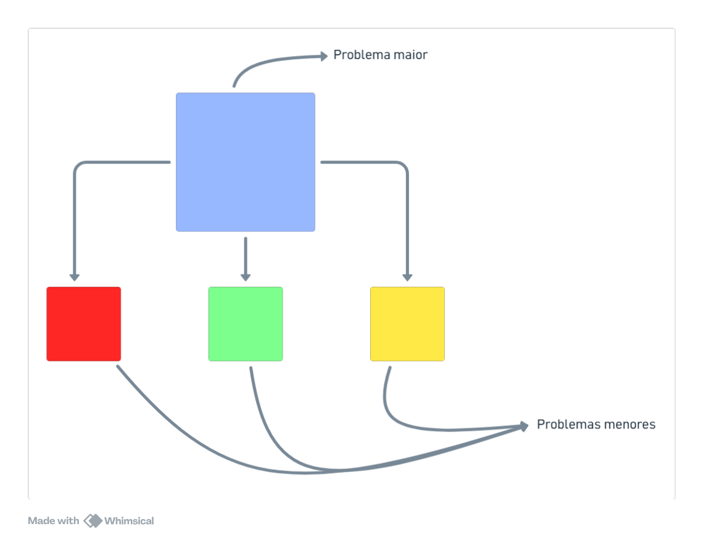
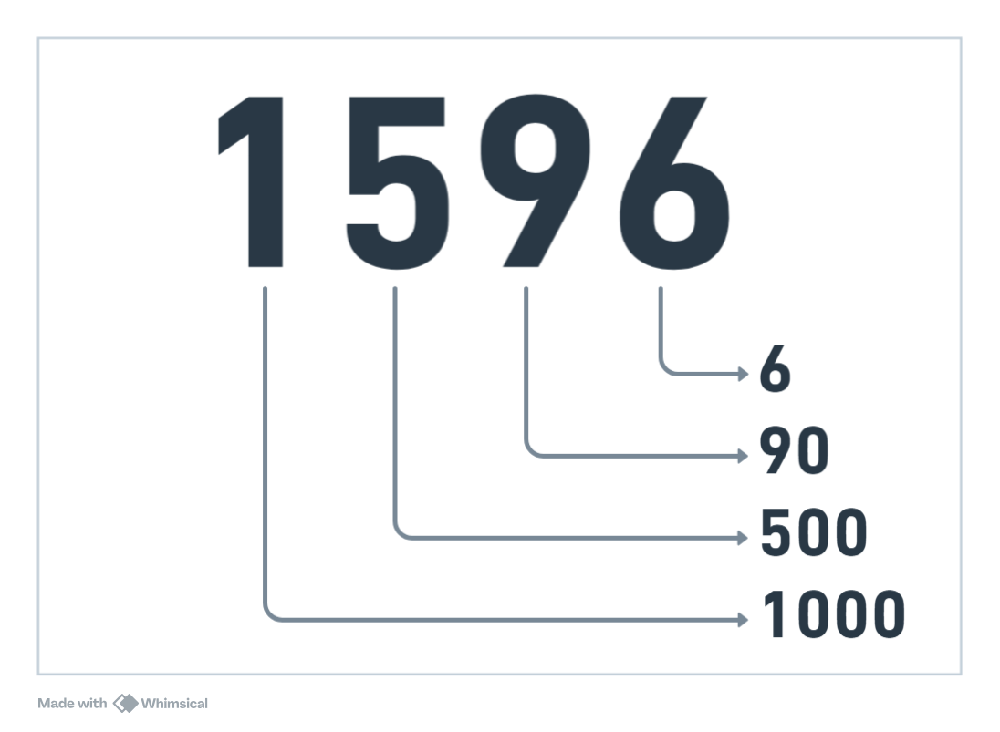
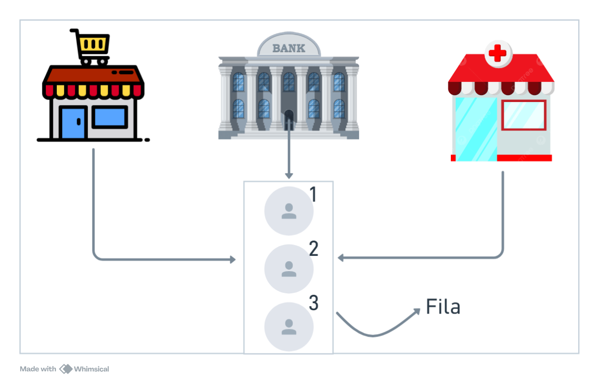
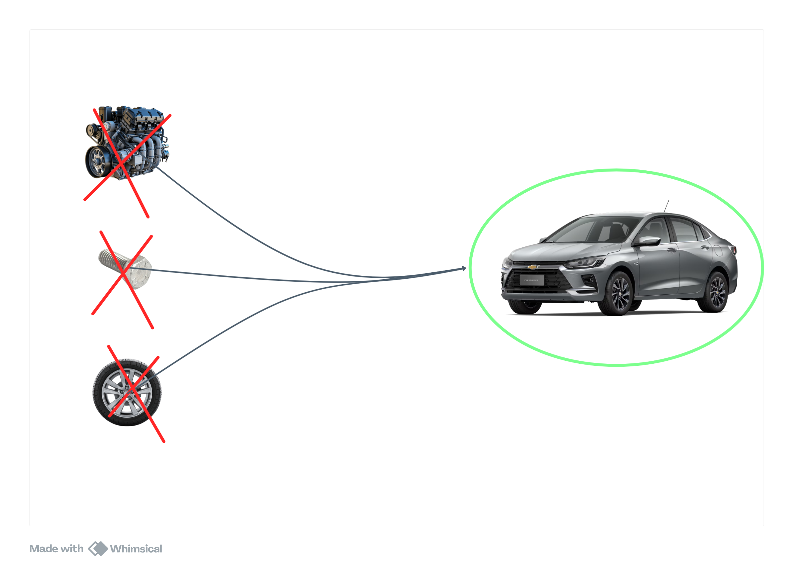
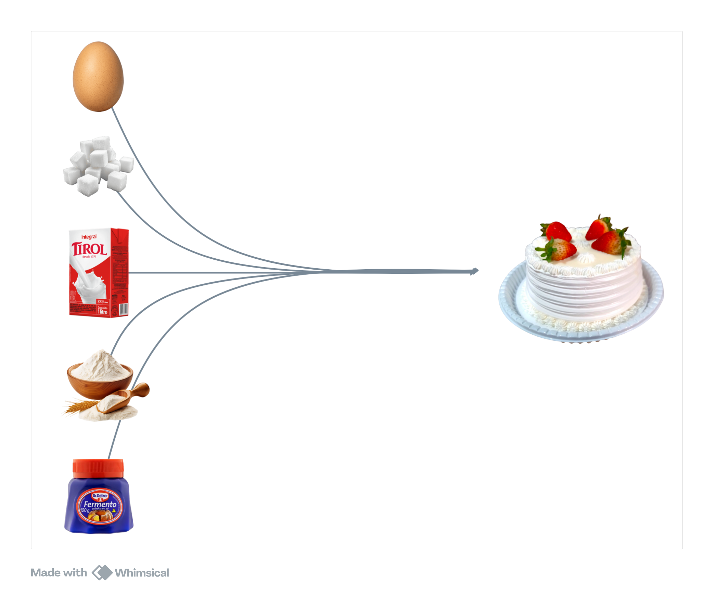

# Logica 🧠

Repositório onde publico exercícios para melhorar a lógica de programação por meio de representações de algoritmos como descrição narrativa, fluxogramas, portugol e scratch.

## Estrutura do repositório
```txt
├─Logica
│   ├───descricao-narrativa
│   │   ├───[exercícios]
│   │   └───exercises.md
│   ├───fluxogramas
│   │   ├───[exercícios]
│   │   └───exercises.md
│   ├───portugol
│   │   ├───CursoEmVideo
│   │       └───[exercícios]
│   │   ├───DavidCreator
│   │       └───[exercícios]
│   │   ├───Outros
│   │       └───[exercícios]
│   ├───scratch
│   │   └───[exercícios]
│   ├───README.md
```

### [descricao-narrativa](descricao-narrativa)
A descrição narrativa é um algoritmo escrito em linguagem natural (português). São simples e muito fáceis de serem criadas.

### [fluxograma](fluxograma)
O Fluxograma é uma representação visual por por meio de figuras visuais com setas. Seguem uma "sintaxe" que deve ser seguida.

### [portugol](portugol)
Portugol é uma pseudo-linguagem para facilitar o aprendizado da lógica de programação por meio de comandos semelhantes a uma linguagem de programação. Foi criada especialmente para ensinar lógica de programação.

### [scratch](scratch)
O Scratch é uma linguagem de programação visual de blocos de arrastar e soltar, projetado para crianças e jovens que querem aprender lógica de programação.

# Algoritmos e Lógica de programação
## Os 4 pilares
Na lógica de programação, temos uma subárea que chamamos de **Pensamento Computacional**. O *PC* é responsável por dividir um problema em 4 pilares menores, que quando dominados, dão a capacidade ao desenvolvedor a resolver problemas de uma forma mais efetiva.


## Decomposição
É a habilidade de dividir um problema grande em problemas menores. Essa é a habilidade mais importante de um programador. Consiste em simplesmete pegar um desafio ou um problema e transforma-lo em um subproblema menor de acordo com algumas perguntas e análises.
<a href="https://pt.wikipedia.org/wiki/Pensamento_computacional"></a>


Na imagem acima, temos um quadrado maior preenchido de azul - representando o problema maior - e nas setas temos quadrados menores representando os problemas menores, ou os subproblemas. A decomposição é basicamente isso.
Vamos ver um exemplo da decomposição
```txt
Carro
    Pneus
        Borracha
        Aço
    Volante
        Borracha
        Metal
    Motor
        Metal
            Ferro
    Vidros
        Areia
    Bancos
        Aço
        Espuma
        Técido
            Nylon
                Petróleo
            Poliéster
    ...
```

Podemos perceber que, a partir de um problema - o carro, dividimos-o em problemas menores - pneus, volante, motor, vidros, bancos - e cada problema menor ainda tem seu problema menor ainda. Isso é decomposição.
Você provavelmente já deve ter visto aquela aula de matemática sobre decomposição de números. Vamos relembrar como é e sua relação com a decomposição do pensamento computacional


## Reconhecimento de padrões
É a habilidade de reconhecer padrões, ou seja, identificar similaridades de exercícios já feitos antes.


## Abstração
É a habilidade de focar apenas nos itens úteis e importantes


## Algoritmos
Algoritmos são sequências de passos ordenados e finitos que resolvem um problema

